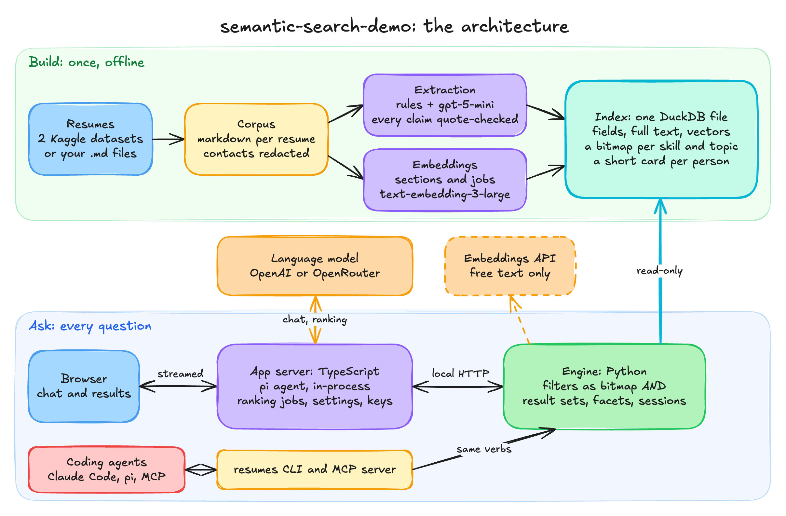
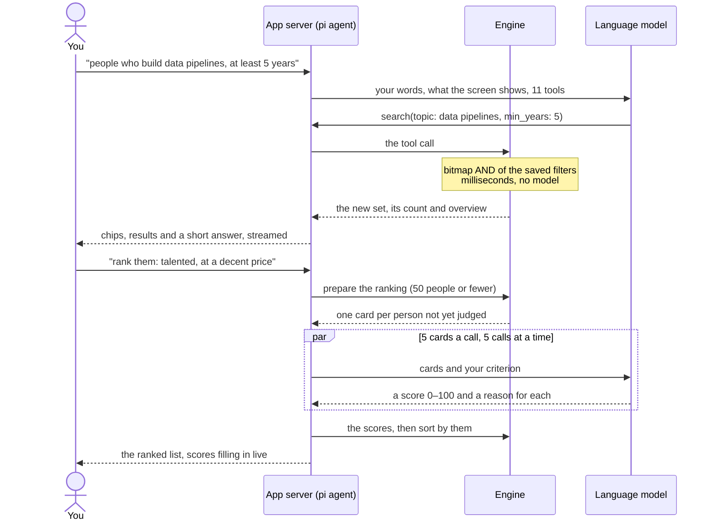

# semantic-search-demo

**A demo, not a product.** It runs on your own machine, with your own AI key, over 2,636 public resumes from Kaggle,
and it comes as it is, without support.

**Try it online, nothing to install: [search.gentlebits.net](https://search.gentlebits.net).** 

It shows fast, semantic search over thousands of documents: ask in plain words, and the question becomes filters you
can see and remove, in milliseconds and without a model. A language model reads only the final shortlist (50 people
at most) to rank it against what you asked for ("the talented ones at a decent price") and to say why for each.

**Plug in a frontier model for state-of-the-art results.** Your question reaches the model in your own words, and so
does every person on the shortlist: no fixed rules, no silent cut-off, a reason for every score. The better the model,
the better the match, so pick the strongest one with the model chip next to Send. Resumes are only the example: the
same two stages fit any large pile of documents that people question in plain words.

## Quick start

macOS or Linux (on Windows: WSL), about 1.2 GB of disk. On Linux, install [uv](https://docs.astral.sh/uv/getting-started/installation/)
and [Node.js](https://nodejs.org) 22.19 or newer instead of the `brew` line.

```sh
brew install uv node
git clone https://github.com/gentleBits/semantic-search-demo.git
cd semantic-search-demo
scripts/setup.sh                      # 2–3 minutes, about 170 MB of downloads, no key needed

cp .env.example .env                  # optional: put your OPENAI_API_KEY in .env, for the chat and the ranking
set -a; . ./.env; set +a              # load it into this terminal (skip it without a key)
uv run resumes web --open             # opens http://localhost:8765; Ctrl-C stops it
```

Without a key you can browse, filter, sort and open all the resumes. The chat and the ranking need a key: OpenAI's,
or an [OpenRouter](https://openrouter.ai/keys) key (`OPENROUTER_API_KEY`) and one of its free models, picked in
Settings (the gear). The app reads the key when it starts. With the default model (`gpt-6.1-sol`) a question costs
well under a cent; ranking a short list, one to three cents.

## How it works

The task: thousands of two-page documents, a growing corpus, loose questions that must match by meaning ("REST APIs"
should find "web services"), and whole requirement documents to match against. One model reading the whole corpus
for every question is too slow and too expensive. So the work is split in two stages, and everything a model can do
ahead of time is done once, at build time.

1. **Build, once.** Each resume becomes clean markdown. A model extracts the structured fields (skills, topics,
   years, seniority, rate, location, availability) and the text is embedded section by section. All of it goes into
   one DuckDB file, with a precomputed bitmap of the people behind every skill and topic.
2. **Narrow, on every question (stage one).** A question is a set of filters. Skills and topics are bitmap
   intersections; years, rate and place are SQL over the fields. No language model is involved, so it takes
   milliseconds. Only free text that names no known skill or topic costs one embedding of the question (cached) and a
   scan of the section vectors.
3. **Match, on the shortlist only (stage two).** A model reads a 70-token card for each of at most 50 people and
   ranks them against the user's own words.

### The architecture



`uv run resumes web` starts both servers: the Python engine on 127.0.0.1:8770 and the app server on
localhost:8765. The chat and the ranking run in the app server, which holds the keys; the page never sees one. The
engine calls no language model: it reads the index and writes small session files.

### One question, end to end



### The build, step by step

- **Corpus.** Each source becomes one markdown file per resume, with its sections kept. Emails, links and phone
  numbers are redacted before anything else sees the text. Exact copies are dropped; near-copies (MinHash, Jaccard
  ≥ 0.7) are grouped, and the newest version stands for the person.
- **Extraction.** Rules read what is certain (sections, dates, years of experience, education, the skills named in
  the vocabulary). Then `gpt-5-mini` returns strict JSON. Every skill, topic and "did" line it reports must quote the
  resume word for word, or it is downgraded or dropped.
- **Vocabulary.** `schema/vocab.csv` holds 348 skills and 78 topics under 2,059 names and aliases, with what implies
  what (Airflow implies data pipelines) and which short names are ambiguous (Go, R, Spark).
- **Embeddings.** Each section and each job is cut into chunks of up to 350 tokens, embedded with
  `text-embedding-3-large` at 1,024 dimensions, as is a short description of every skill and topic.
- **Bitmaps.** For every skill and topic, a compressed (Roaring) bitmap of its members, decided once: *exact* members
  from the extraction and full-text hits, *by meaning* members whose text is close to the term's description (cosine
  ≥ 0.50).
- **Cards.** One card of at most 110 tokens per person (70 on average): title, years, rate, place, the skills used,
  and the one thing they did. This is what the ranking model reads.
- **Caching.** Every model output is cached by a hash of its input, so a rebuild with nothing new costs nothing. The
  outputs for the public data are published as seed packs: `scripts/setup.sh` builds the whole index from them, with
  no key, in about a minute.

### Design choices

- **Filters and similarity are not blended into one score.** What you state ("only Java", "5+ years", "under €80")
  is an exact set operation. Similarity decides membership only at the edges (a term's aliases and its "by meaning"
  members) and the first order: coverage, then reciprocal-rank fusion of evidence level, BM25 and cosine. Soft wishes
  ("a decent price") go to the ranking model, in your own words.
- **Nothing is searched twice.** Each condition is evaluated once and saved with the conversation, and a result set
  is the intersection of the saved ones. Removing a filter, undo and history cost what paging costs.
- **The whole matching set, never a silent top-k.** Stage one keeps everyone who matches, so recall is decided by
  membership, not by a cut-off. Ranking is capped at 50 people (about 3,500 tokens of cards, one pass, comparable
  scores); above that the engine refuses and names the filters that would narrow it.
- **Fields where you would say "only", "sort by" or "how many"; embeddings where you would say "someone like" or
  "good at".** Skills, topics, years, seniority, rate, location and availability are fields. The narrative of what
  someone built is embedded text for retrieval, and card text for the judge.
- **Scores stick to the person.** After a filter change, only the people not yet judged are ranked, with the three
  highest and three lowest scored so far shown as anchors, so the scale stays the same.
- **An agent, not a script.** The assistant runs on [pi](https://www.npmjs.com/package/@earendil-works/pi-agent-core)
  inside the app server. Its tools describe the data, and its prompt says only what the model cannot know; there are
  no rules mapping phrases to tools. Each conversation keeps a pi session as its memory, summarised past 120k tokens.
- **One file, no infrastructure.** One DuckDB file holds the fields, the full-text index and the vectors: no vector
  database, no search server. A rebuild writes a new file and swaps a link to it atomically, so open readers keep
  the old one.

### Where the code is

| Folder | Holds |
|---|---|
| `src/agentic_search/` | the engine: `ingest/` (corpus), `extract/`, `index/`, `query/`, `session/`, `web/` (its HTTP API), `cli.py`, `mcp.py` |
| `web-ts/` | the app server (`src/`: the assistant, ranking, settings), the page (`public/`, no build step), its tests |
| `schema/vocab.csv` | the skills and topics, with aliases, implications and ambiguous forms |
| `.agents/`, `.claude/`, `.pi/` | the skill and slash commands for coding agents |
| `scripts/` | `setup.sh`, `get-data.sh`, the benchmarks |
| `tests/` | the Python tests; `golden/` replays a reference conversation step by step |

## More

- **The command line, your own resumes, rebuilding:** [docs/USAGE.md](docs/USAGE.md)
- **Coding agents (Claude Code, pi, MCP):** [docs/AGENTS.md](docs/AGENTS.md)
- **Settings, accounts and the email and phone check:** [docs/CONFIGURATION.md](docs/CONFIGURATION.md)
- **Tests, issues and pull requests:** [CONTRIBUTING.md](CONTRIBUTING.md)

## If something goes wrong

- **"port in use"**: another `resumes web` is still running; stop it (Ctrl-C in its terminal) and start again.
- **"Node 22.19 or newer is missing"** or **"uv is missing"**: install it as shown above, then run `scripts/setup.sh` again.
- **The chat says "no key"**: load the key into the same terminal before `uv run resumes web`.

## Licence

The code is MIT ([LICENSE](LICENSE)). The resumes are two CC0 datasets on Kaggle
([one](https://www.kaggle.com/datasets/snehaanbhawal/resume-dataset),
[two](https://www.kaggle.com/datasets/jillanisofttech/updated-resume-dataset)), downloaded by the setup, not stored
here. Their hourly rates are estimates. Third-party code and fonts: [THIRD_PARTY_NOTICES.md](THIRD_PARTY_NOTICES.md).
